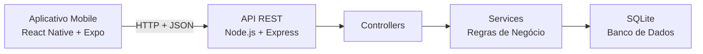
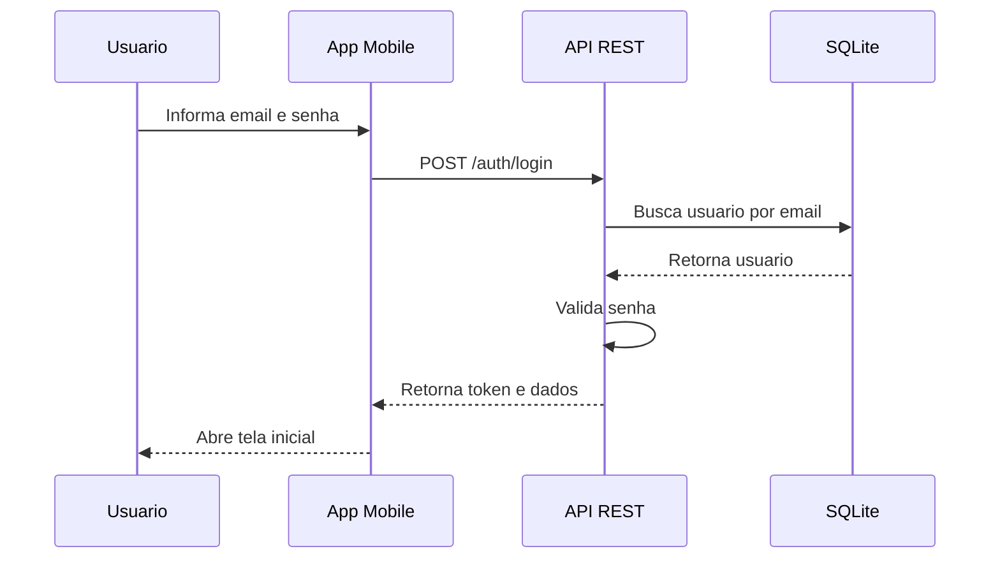
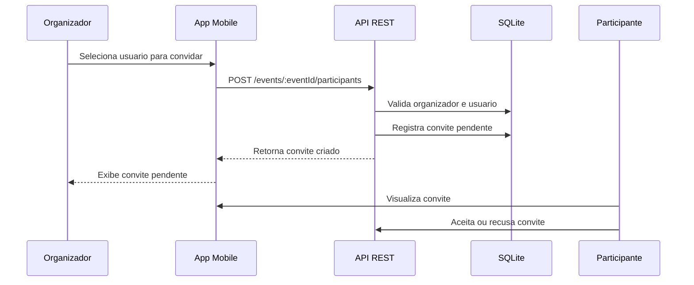
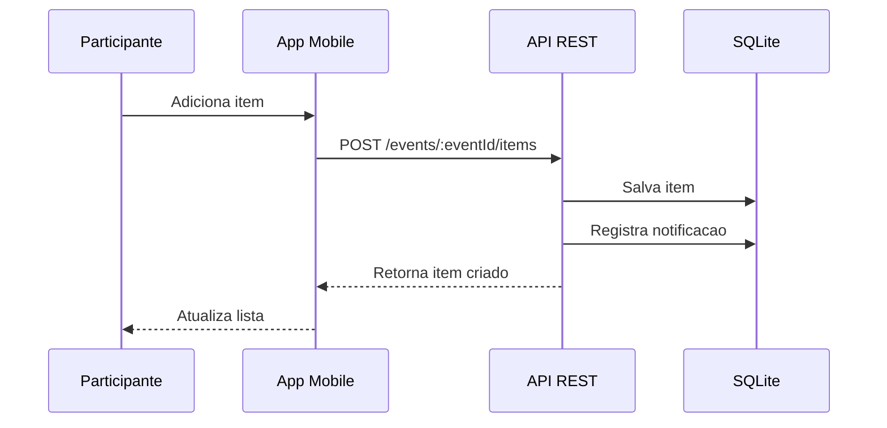
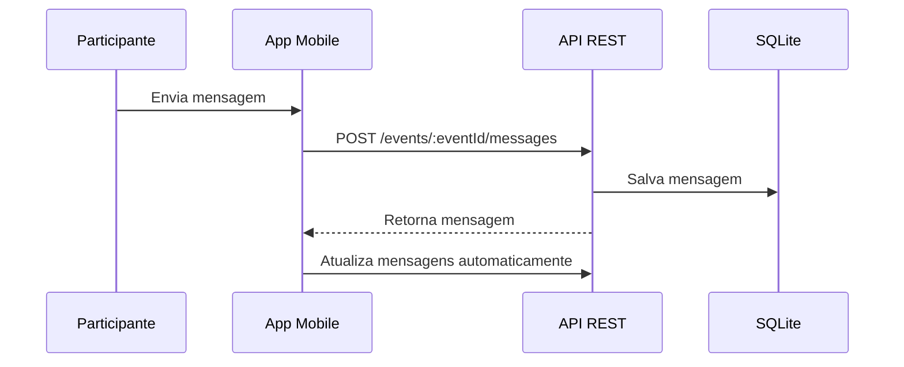

# EuLevo

## Documentação Atualizada do Projeto

**Projeto:** EuLevo
**Tipo de sistema:** Aplicativo móvel com backend REST
**Versão:** 1.1.0
**Status:** Funcional em ambiente local
**Frontend:** React Native + Expo
**Backend:** Node.js + Express
**Banco de dados:** SQLite
**Ano:** 2026

---

# 1. Visão Geral

O **EuLevo** é um aplicativo móvel desenvolvido para auxiliar na organização colaborativa de eventos. O sistema permite que usuários criem eventos, convidem participantes, adicionem itens, assumam responsabilidades, conversem por chat e acompanhem notificações e histórico de alterações.

A versão atual do projeto representa uma evolução da versão inicial, com melhorias funcionais, visuais e estruturais. O sistema passou a contar com uma interface mais moderna, identidade visual própria, nova tela de login, controle de convites pendentes, edição de perfil, atualização automática do chat e regras mais completas para criação e exclusão de itens.

O projeto utiliza uma arquitetura cliente-servidor, na qual o aplicativo mobile consome uma API REST responsável pela autenticação, validação das regras de negócio e persistência dos dados em banco SQLite.

---

# 2. Objetivo do Sistema

## 2.1 Objetivo Geral

Desenvolver um aplicativo móvel funcional para gerenciamento colaborativo de eventos, permitindo que os usuários organizem listas de itens, convidem participantes, assumam responsabilidades e se comuniquem dentro do próprio evento.

## 2.2 Objetivos Específicos

* Permitir cadastro e login de usuários.
* Permitir criação e exclusão de eventos.
* Permitir convite de participantes cadastrados.
* Exibir convites pendentes para o administrador.
* Permitir aceitar e recusar convites.
* Permitir que qualquer participante adicione itens.
* Permitir que participantes assumam itens.
* Permitir exclusão de itens com regra de permissão.
* Permitir chat por evento.
* Permitir edição do nome do perfil.
* Exibir notificações e histórico de ações.
* Integrar frontend mobile com backend REST.
* Garantir persistência de dados em SQLite.
* Aplicar autenticação com JWT e senhas protegidas com hash.

---

# 3. Versão Atual

## 3.1 Versão 1.1.0

A versão atual do sistema é a **1.1.0**.

Essa versão foi definida porque o projeto deixou de ser apenas uma versão inicial e passou a incluir correções importantes, novas regras funcionais e melhorias visuais significativas.

## 3.2 Principais Atualizações da Versão 1.1.0

* Nova identidade visual baseada na paleta azul e branca.
* Logo do EuLevo adicionada ao projeto.
* Tela de login refeita.
* Textos da interface revisados para português.
* Remoção de dados preenchidos automaticamente no login.
* Correção da edição de perfil.
* Usuário pode alterar o próprio nome.
* Sistema de convites corrigido.
* Convite enviado aparece como pendente para o administrador.
* Participante convidado pode aceitar ou recusar o convite.
* Tela de participantes passou a ter busca direta por usuários.
* Chat passou a atualizar automaticamente.
* Itens passaram a atualizar para participantes.
* Qualquer participante pode adicionar item.
* Administrador pode excluir qualquer item.
* Participante pode excluir apenas item criado por ele.
* Evento excluído pelo administrador some para os participantes.
* Tela inicial reformulada com cards de eventos.
* Botão “Ver grupo” adicionado aos cards.
* Botão flutuante para criar evento mantido.
* Alertas foram substituídos por modais visuais personalizados.
* Backend ajustado para novas regras de itens, convites e perfil.

---

# 4. Público-Alvo

O sistema é destinado a pessoas que desejam organizar eventos de forma colaborativa, como:

* confraternizações;
* aniversários;
* churrascos;
* encontros acadêmicos;
* reuniões entre amigos;
* eventos familiares;
* atividades em grupo.

Os usuários podem atuar como **organizadores** ou **participantes**.

---

# 5. Perfis de Usuário

## 5.1 Organizador

O organizador é o usuário que cria o evento. Ele possui permissões para:

* criar evento;
* excluir evento;
* convidar participantes;
* visualizar participantes;
* adicionar itens;
* assumir itens;
* excluir qualquer item;
* acessar chat;
* visualizar notificações;
* visualizar histórico.

## 5.2 Participante

O participante é o usuário que aceita o convite para participar de um evento. Ele pode:

* visualizar eventos dos quais participa;
* aceitar ou recusar convites;
* visualizar participantes;
* adicionar itens;
* assumir itens;
* excluir itens criados por ele mesmo;
* enviar mensagens no chat;
* visualizar notificações;
* visualizar histórico.

---

# 6. Funcionalidades Implementadas

## 6.1 Autenticação

O sistema permite que o usuário acesse sua conta por meio de e-mail e senha.

Funcionalidades relacionadas:

* cadastro de usuário;
* login;
* logout;
* recuperação de senha simplificada;
* proteção de rotas com token JWT;
* armazenamento de senha com hash bcrypt.

## 6.2 Perfil

A tela de perfil permite visualizar os dados do usuário e editar o nome da conta.

Funcionalidades relacionadas:

* visualização do nome e e-mail;
* botão de editar perfil;
* modal para alteração do nome;
* validação de nome obrigatório;
* atualização do nome no backend;
* atualização visual após salvar.

## 6.3 Eventos

A tela inicial lista os eventos dos quais o usuário participa.

Funcionalidades relacionadas:

* listagem de eventos;
* criação de evento;
* exclusão de evento pelo criador;
* visualização dos detalhes do evento;
* botão flutuante para criar novo evento;
* cards com botão “Ver grupo”.

## 6.4 Participantes e Convites

O sistema permite convidar usuários cadastrados para participar de eventos.

Funcionalidades relacionadas:

* listagem de participantes confirmados;
* busca de usuários cadastrados;
* envio de convite;
* exibição de convite pendente;
* proteção contra convite duplicado;
* aceitar convite;
* recusar convite;
* atualização da lista após aceite.

## 6.5 Itens

Os itens representam o que precisa ser levado ou organizado no evento.

Funcionalidades relacionadas:

* criação de item;
* listagem de itens;
* edição de item;
* exclusão de item;
* assumir item;
* desmarcar item;
* apenas um responsável por item;
* qualquer participante pode adicionar item;
* administrador pode excluir qualquer item;
* participante pode excluir apenas item criado por ele.

## 6.6 Chat

Cada evento possui um chat próprio.

Funcionalidades relacionadas:

* envio de mensagens;
* listagem de mensagens;
* acesso restrito aos participantes;
* atualização automática por intervalo de tempo;
* identificação do autor da mensagem;
* diferenciação visual entre mensagens próprias e de outros participantes.

## 6.7 Notificações

O sistema gera notificações relacionadas a ações importantes do evento.

Funcionalidades relacionadas:

* notificação de item criado;
* notificação de item atualizado;
* notificação de item excluído;
* listagem de notificações;
* marcação de notificações como lidas.

## 6.8 Histórico

O histórico registra ações relevantes realizadas no evento.

Funcionalidades relacionadas:

* criação de item;
* edição de item;
* exclusão de item;
* alteração de responsável;
* acompanhamento das mudanças feitas durante a organização do evento.

---

# 7. Requisitos Funcionais Atualizados

| ID   | Requisito                                                   | Status                             |
| ---- | ----------------------------------------------------------- | ---------------------------------- |
| RF01 | O sistema deve permitir cadastro de usuário.                | Implementado                       |
| RF02 | O sistema deve permitir login com e-mail e senha.           | Implementado                       |
| RF03 | O sistema deve permitir recuperação de senha.               | Implementado de forma simplificada |
| RF04 | O sistema deve permitir edição do nome do perfil.           | Implementado                       |
| RF05 | O sistema deve listar eventos do usuário autenticado.       | Implementado                       |
| RF06 | O sistema deve permitir criar evento.                       | Implementado                       |
| RF07 | O sistema deve permitir excluir evento apenas pelo criador. | Implementado                       |
| RF08 | O sistema deve listar participantes do evento.              | Implementado                       |
| RF09 | O sistema deve permitir convidar participantes cadastrados. | Implementado                       |
| RF10 | O sistema deve exibir convite pendente após envio.          | Implementado                       |
| RF11 | O sistema deve permitir aceitar convite.                    | Implementado                       |
| RF12 | O sistema deve permitir recusar convite.                    | Implementado                       |
| RF13 | O sistema deve permitir adicionar itens ao evento.          | Implementado                       |
| RF14 | O sistema deve permitir editar itens.                       | Implementado                       |
| RF15 | O sistema deve permitir excluir itens.                      | Implementado                       |
| RF16 | O sistema deve permitir assumir item.                       | Implementado                       |
| RF17 | O sistema deve permitir desmarcar item.                     | Implementado                       |
| RF18 | O sistema deve permitir chat por evento.                    | Implementado                       |
| RF19 | O sistema deve permitir visualizar notificações.            | Implementado                       |
| RF20 | O sistema deve permitir visualizar histórico.               | Implementado                       |
| RF21 | O sistema deve permitir logout.                             | Implementado                       |

---

# 8. Requisitos Não Funcionais Atualizados

| ID    | Requisito                                                      | Status           |
| ----- | -------------------------------------------------------------- | ---------------- |
| RNF01 | O sistema deve possuir arquitetura cliente-servidor.           | Implementado     |
| RNF02 | O aplicativo deve ser executado via Expo Go em ambiente local. | Implementado     |
| RNF03 | O backend deve fornecer API REST.                              | Implementado     |
| RNF04 | O sistema deve utilizar banco persistente.                     | Implementado     |
| RNF05 | O sistema deve utilizar autenticação com JWT.                  | Implementado     |
| RNF06 | O sistema deve armazenar senhas com hash.                      | Implementado     |
| RNF07 | O sistema deve possuir interface simples e intuitiva.          | Implementado     |
| RNF08 | O sistema deve usar variáveis de ambiente.                     | Implementado     |
| RNF09 | O sistema deve documentar endpoints via Swagger.               | Implementado     |
| RNF10 | O sistema deve possuir boa separação entre frontend e backend. | Implementado     |
| RNF11 | O sistema deve realizar backup automático.                     | Não implementado |
| RNF12 | O sistema deve garantir alta disponibilidade.                  | Não implementado |
| RNF13 | O sistema deve bloquear login após 5 tentativas incorretas.    | Não implementado |

---

# 9. Regras de Negócio Atualizadas

| ID   | Regra de Negócio                                                     | Status       |
| ---- | -------------------------------------------------------------------- | ------------ |
| RN01 | O e-mail do usuário deve ser único.                                  | Implementado |
| RN02 | A senha deve possuir no mínimo 6 caracteres.                         | Implementado |
| RN03 | Apenas usuários autenticados podem acessar áreas protegidas.         | Implementado |
| RN04 | Apenas o próprio usuário pode editar seu perfil.                     | Implementado |
| RN05 | O nome do perfil não pode ficar vazio.                               | Implementado |
| RN06 | Apenas o criador pode excluir o evento.                              | Implementado |
| RN07 | Apenas o organizador pode convidar participantes.                    | Implementado |
| RN08 | O usuário convidado precisa estar cadastrado.                        | Implementado |
| RN09 | Um usuário já participante não pode ser convidado novamente.         | Implementado |
| RN10 | Um usuário não pode ter dois convites pendentes para o mesmo evento. | Implementado |
| RN11 | Apenas participantes podem acessar o chat do evento.                 | Implementado |
| RN12 | Apenas participantes podem adicionar itens.                          | Implementado |
| RN13 | O nome do item é obrigatório.                                        | Implementado |
| RN14 | A quantidade do item deve ser maior que zero.                        | Implementado |
| RN15 | Um item só pode ter um responsável por vez.                          | Implementado |
| RN16 | O responsável ou o organizador pode desmarcar um item.               | Implementado |
| RN17 | O administrador pode excluir qualquer item.                          | Implementado |
| RN18 | O participante pode excluir apenas itens criados por ele.            | Implementado |
| RN19 | Mensagens devem estar vinculadas ao evento.                          | Implementado |
| RN20 | Histórico deve registrar ações relevantes de itens.                  | Implementado |

---

# 10. Casos de Uso Atualizados

| Código | Caso de Uso                 | Ator Principal                   | Status                    |
| ------ | --------------------------- | -------------------------------- | ------------------------- |
| UC01   | Cadastrar usuário           | Usuário                          | Implementado              |
| UC02   | Fazer login                 | Usuário                          | Implementado              |
| UC03   | Recuperar senha             | Usuário                          | Implementado simplificado |
| UC04   | Editar perfil               | Usuário                          | Implementado              |
| UC05   | Criar evento                | Organizador                      | Implementado              |
| UC06   | Excluir evento              | Organizador                      | Implementado              |
| UC07   | Convidar participante       | Organizador                      | Implementado              |
| UC08   | Visualizar convite pendente | Organizador                      | Implementado              |
| UC09   | Aceitar convite             | Participante                     | Implementado              |
| UC10   | Recusar convite             | Participante                     | Implementado              |
| UC11   | Visualizar participantes    | Participante                     | Implementado              |
| UC12   | Adicionar item              | Participante                     | Implementado              |
| UC13   | Editar item                 | Participante                     | Implementado              |
| UC14   | Excluir item                | Organizador/Participante criador | Implementado              |
| UC15   | Assumir item                | Participante                     | Implementado              |
| UC16   | Desmarcar item              | Responsável/Organizador          | Implementado              |
| UC17   | Usar chat                   | Participante                     | Implementado              |
| UC18   | Visualizar notificações     | Participante                     | Implementado              |
| UC19   | Visualizar histórico        | Participante                     | Implementado              |
| UC20   | Sair da conta               | Usuário                          | Implementado              |

---

# 11. Arquitetura Atual do Sistema

O sistema utiliza uma arquitetura cliente-servidor, separando as responsabilidades entre aplicativo mobile e backend.



## 11.1 Frontend

O frontend é responsável pela interface e pela interação com o usuário.

Principais responsabilidades:

* telas do aplicativo;
* navegação;
* formulários;
* consumo da API;
* exibição de mensagens;
* atualização visual;
* gerenciamento de estado da interface.

## 11.2 Backend

O backend é responsável pelas regras de negócio e persistência.

Principais responsabilidades:

* autenticação;
* validação de dados;
* proteção de rotas;
* gerenciamento de usuários;
* gerenciamento de eventos;
* gerenciamento de convites;
* gerenciamento de itens;
* chat;
* notificações;
* histórico;
* acesso ao banco SQLite.

---

# 12. Organização Atual do Projeto

## 12.1 Frontend

```text
src/
|-- core/
|   |-- api/
|   |-- navigation/
|   |-- store/
|   |-- theme/
|   `-- utils/
|-- features/
|   |-- auth/
|   |-- chat/
|   |-- events/
|   `-- participants/
`-- shared/
    |-- components/
    `-- screens/
```

## 12.2 Backend

```text
backend/
|-- data/
|-- src/
|   |-- config/
|   |-- controllers/
|   |-- core/
|   |-- docs/
|   |-- middlewares/
|   |-- routes/
|   |-- seed/
|   |-- services/
|   |-- app.js
|   `-- server.js
|-- package.json
`-- .env.example
```

---

# 13. Modelagem de Dados Atualizada

## 13.1 Entidades

### Usuário

* id
* name
* email
* password

### Evento

* id
* name
* description
* date
* ownerId

### Participante

* eventId
* userId

### Convite

* id
* eventId
* email
* invitedUserId
* invitedByUserId
* status
* createdAt

### Item

* id
* eventId
* name
* quantity
* assignedUserId
* createdById

### Mensagem

* id
* eventId
* userId
* content
* timestamp

### Notificação

* id
* eventId
* type
* message
* read
* createdAt

---

# 14. Banco de Dados

O sistema utiliza **SQLite** como banco de dados local e persistente.

## 14.1 Arquivo do Banco

```text
backend/data/eulevo.db
```

## 14.2 Tabelas Utilizadas

* users
* events
* participants
* invitations
* items
* messages
* notifications

## 14.3 Persistência

Os dados são salvos no banco SQLite do backend, permitindo que eventos, usuários, convites, mensagens, itens e notificações permaneçam registrados mesmo após reiniciar o servidor.

---

# 15. API REST Atualizada

## 15.1 Autenticação

| Método | Endpoint                 | Descrição                 |
| ------ | ------------------------ | ------------------------- |
| POST   | `/auth/login`            | Realiza login do usuário. |
| POST   | `/auth/register`         | Cadastra usuário.         |
| POST   | `/auth/recover-password` | Redefine senha.           |

## 15.2 Usuários

| Método | Endpoint         | Descrição                   |
| ------ | ---------------- | --------------------------- |
| GET    | `/users`         | Lista usuários cadastrados. |
| GET    | `/users/:userId` | Busca usuário por id.       |
| PATCH  | `/users/:userId` | Atualiza o nome do usuário. |

## 15.3 Eventos

| Método | Endpoint                 | Descrição                 |
| ------ | ------------------------ | ------------------------- |
| GET    | `/events?userId=:userId` | Lista eventos do usuário. |
| POST   | `/events`                | Cria evento.              |
| GET    | `/events/:eventId`       | Busca evento.             |
| DELETE | `/events/:eventId`       | Exclui evento.            |

## 15.4 Participantes e Convites

| Método | Endpoint                             | Descrição                            |
| ------ | ------------------------------------ | ------------------------------------ |
| GET    | `/events/:eventId/participants`      | Lista participantes.                 |
| POST   | `/events/:eventId/participants`      | Envia convite.                       |
| GET    | `/events/:eventId/invitations`       | Lista convites pendentes do evento.  |
| GET    | `/invitations?userId=:userId`        | Lista convites pendentes do usuário. |
| POST   | `/invitations/:invitationId/accept`  | Aceita convite.                      |
| POST   | `/invitations/:invitationId/decline` | Recusa convite.                      |

## 15.5 Itens

| Método | Endpoint                                  | Descrição      |
| ------ | ----------------------------------------- | -------------- |
| GET    | `/events/:eventId/items`                  | Lista itens.   |
| POST   | `/events/:eventId/items`                  | Cria item.     |
| PATCH  | `/events/:eventId/items/:itemId`          | Atualiza item. |
| DELETE | `/events/:eventId/items/:itemId`          | Exclui item.   |
| POST   | `/events/:eventId/items/:itemId/assign`   | Assume item.   |
| POST   | `/events/:eventId/items/:itemId/unassign` | Desmarca item. |

## 15.6 Chat

| Método | Endpoint                    | Descrição        |
| ------ | --------------------------- | ---------------- |
| GET    | `/events/:eventId/messages` | Lista mensagens. |
| POST   | `/events/:eventId/messages` | Envia mensagem.  |

## 15.7 Notificações

| Método | Endpoint                        | Descrição                      |
| ------ | ------------------------------- | ------------------------------ |
| GET    | `/notifications?userId=:userId` | Lista notificações.            |
| POST   | `/notifications/read-all`       | Marca notificações como lidas. |

## 15.8 Histórico

| Método | Endpoint                   | Descrição                  |
| ------ | -------------------------- | -------------------------- |
| GET    | `/events/:eventId/history` | Lista histórico do evento. |

---

# 16. Segurança Atual

## 16.1 JWT

O sistema utiliza autenticação baseada em token JWT. Após login bem-sucedido, o usuário recebe um token que deve ser enviado nas rotas protegidas.

## 16.2 Hash de Senha

As senhas são protegidas com hash usando bcrypt.

## 16.3 Rotas Protegidas

Todas as rotas sensíveis exigem autenticação, exceto:

* login;
* cadastro;
* recuperação de senha;
* health check.

## 16.4 Validações

O backend valida dados obrigatórios, permissões e regras de negócio antes de alterar o banco.

---

# 17. Interface Atual

A interface da versão 1.1.0 foi reformulada com foco em identidade visual e usabilidade.

## 17.1 Login

A tela de login agora possui:

* logo do EuLevo;
* paleta azul e branca;
* campos em português;
* botão de entrar;
* opção de criar conta;
* opção de recuperar senha.

## 17.2 Tela Inicial

A tela inicial possui:

* saudação ao usuário;
* resumo de eventos, avisos e convites;
* cards de eventos;
* botão “Ver grupo”;
* botão flutuante para criar evento.

## 17.3 Tela de Participantes

A tela de participantes possui:

* lista de participantes confirmados;
* busca direta por usuários cadastrados;
* botão de convidar;
* indicação de convite pendente;
* modal de confirmação visual.

## 17.4 Tela de Evento

A tela de evento possui:

* lista de itens;
* adição de itens;
* exclusão de itens;
* opção de assumir item;
* acesso ao chat;
* acesso aos participantes;
* acesso ao histórico.

## 17.5 Tela de Perfil

A tela de perfil possui:

* dados do usuário;
* botão para editar perfil;
* modal para alterar nome;
* botão de sair.

---

# 18. Fluxos Atualizados

## 18.1 Fluxo de Login



## 18.2 Fluxo de Convite



## 18.3 Fluxo de Item



## 18.4 Fluxo de Chat



---

# 19. Como Executar o Projeto

## 19.1 Executar o Aplicativo

Na raiz do projeto:

```bash
npm install
copy .env.example .env
npx expo start --lan --clear
```

Configure o arquivo `.env` com o IP da máquina:

```text
EXPO_PUBLIC_API_URL=http://SEU_IP_NA_REDE:3333
```

Exemplo:

```text
EXPO_PUBLIC_API_URL=http://192.168.0.10:3333
```

Depois, escaneie o QR Code no Expo Go.

## 19.2 Executar o Backend

Na pasta do backend:

```bash
cd backend
npm install
copy .env.example .env
npm start
```

Ou, pela raiz:

```bash
npm run backend
```

O backend será iniciado em:

```text
http://localhost:3333
```

A documentação Swagger estará em:

```text
http://localhost:3333/docs
```

---

# 20. Evidências para Apresentação

Durante a apresentação, a equipe pode demonstrar:

* tela de login atualizada;
* criação de conta;
* login;
* edição de perfil;
* criação de evento;
* convite de participantes;
* convite pendente;
* aceite ou recusa de convite;
* adição de item;
* exclusão de item;
* regra de permissão para exclusão;
* chat atualizando;
* histórico;
* notificações;
* Swagger da API;
* banco SQLite persistente;
* estrutura separada entre frontend e backend.

---

# 21. Limitações Atuais

Apesar de funcional, a versão 1.1.0 ainda possui limitações:

* o backend ainda roda localmente;
* a alta disponibilidade não foi implementada;
* o backup automático não foi implementado;
* o bloqueio após 5 tentativas de login incorretas ainda não foi implementado;
* o chat atualiza por intervalo de tempo, não por WebSocket;
* push notifications reais ainda não foram integradas;
* a tela de carregamento do Expo Go exibe informações do ambiente de desenvolvimento.

---

# 22. Melhorias Futuras

* Implementar bloqueio temporário após 5 tentativas de login incorretas.
* Implementar backup automático.
* Hospedar backend em ambiente online.
* Migrar SQLite para banco em nuvem ou PostgreSQL.
* Implementar WebSocket para chat em tempo real.
* Integrar notificações push reais.
* Melhorar recuperação de senha com token expirável.
* Gerar APK/AAB para versão de produção.
* Melhorar splash screen fora do Expo Go.

---

# 23. Conclusão

A versão atual do **EuLevo** representa uma evolução significativa em relação à versão inicial do projeto. O sistema agora possui uma interface mais moderna, identidade visual própria, fluxo de convites funcional, edição de perfil, regras de permissão para itens, chat atualizado automaticamente e integração consistente com backend REST.

O projeto atende aos principais objetivos de uma aplicação mobile integrada a uma API, com persistência de dados, autenticação, separação entre frontend e backend e aplicação de regras de negócio. Embora ainda existam melhorias futuras, a versão 1.1.0 está funcional em ambiente local e adequada para apresentação acadêmica.

---

# 24. Referências Internas do Projeto

* Frontend: `src/`
* Backend: `backend/src/`
* Store principal: `src/core/store/eulevo-store.js`
* Cliente da API: `src/core/api/client.js`
* Serviço principal do backend: `backend/src/services/eulevo-service.js`
* Rotas do backend: `backend/src/routes/`
* Controllers do backend: `backend/src/controllers/`
* Banco de dados: `backend/data/eulevo.db`
* Swagger: `http://localhost:3333/docs`
