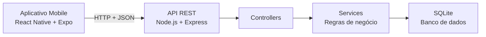

# Documentação EuLevo v 1.1.0

> **Universidade Federal do Amazonas — UFAM**  
> **Instituto de Ciências Exatas e Tecnologia — ICET**  
> **Curso:** Sistemas de Informação  
> **Local e ano:** Itacoatiara/AM — 2026  
> **Versão do aplicativo:** 1.1.0  
> **Versão desta documentação:** 2.0  
> **Status do sistema:** funcional em ambiente local

---

## Controle do documento

### Ficha técnica

| Papel | Integrante |
|---|---|
| Desenvolvedor 1 | Ana Clarissy |
| Desenvolvedor 2 | Bruno Manoel |
| Desenvolvedor 3 | Carlos Eduardo |
| Desenvolvedor 4 | Cintia Seixas |
| Desenvolvedor 5 | Nelio Tobias |

### Público-alvo do documento

Esta documentação destina-se à equipe de desenvolvimento, ao Product Owner, aos avaliadores, ao cliente e aos demais interessados em compreender o funcionamento, a arquitetura, as regras de negócio e a evolução do sistema EuLevo.

### Registro de alterações

| Versão da documentação | Responsáveis | Data | Alterações |
|---|---|---:|---|
| 1.0 | Desenvolvedores 2, 3, 4 e 5 | 29/05/2026 | Atualização dos diagramas de casos de uso, classes e objetos; revisão dos requisitos; definição inicial da arquitetura e dos padrões de projeto. |
| 1.1 | Desenvolvedores 1 e 4 | 04/06/2026 | Construção dos diagramas de sequência. |
| 1.2 | Desenvolvedor 2 | 04/06/2026 | Construção do diagrama de classes. |
| 1.3 | Desenvolvedor 3 | 05/06/2026 | Construção do diagrama de objetos. |
| 1.4 | Desenvolvedor 2 | 05/06/2026 | Revisão geral da documentação inicial. |
| 2.0 | Equipe do projeto | 22/06/2026 | Consolidação da documentação inicial com a versão implementada 1.1.0: arquitetura cliente-servidor, React Native + Expo, Node.js + Express, SQLite, JWT, regras de convites, itens, chat, perfil, API REST e limitações atuais. |

> **Critério de atualização:** em caso de divergência entre a documentação inicial e o comportamento da versão 1.1.0, prevalecem as regras, funcionalidades e restrições descritas nesta versão consolidada.

---

## Sumário

1. [Introdução](#1-introdução)  
2. [Versão atual e evolução do projeto](#2-versão-atual-e-evolução-do-projeto)  
3. [Requisitos do sistema](#3-requisitos-do-sistema)  
4. [Regras de negócio](#4-regras-de-negócio)  
5. [Casos de uso e fluxos principais](#5-casos-de-uso-e-fluxos-principais)  
6. [Diagramas UML](#6-diagramas-uml)  
7. [Arquitetura e padrões de projeto](#7-arquitetura-e-padrões-de-projeto)  
8. [Organização do projeto, dados e API](#8-organização-do-projeto-dados-e-api)  
9. [Segurança, interface e execução](#9-segurança-interface-e-execução)  
10. [Análise de riscos, limitações e evolução](#10-análise-de-riscos-limitações-e-evolução)  
11. [Apêndice](#11-apêndice)  

---

# 1. Introdução

## 1.1 Visão geral do documento

Este documento consolida a especificação inicial e a documentação da versão atualmente implementada do **EuLevo**. Ele apresenta a finalidade do sistema, os usuários atendidos, os requisitos funcionais e não funcionais, as regras de negócio, os casos de uso, os diagramas UML, a arquitetura técnica, a organização do código, a modelagem de dados, a API REST, os procedimentos de execução, os riscos e as limitações conhecidas.

A primeira documentação descrevia a proposta do aplicativo como uma solução colaborativa para organização de confraternizações. Com o andamento do desenvolvimento, a solução passou a possuir uma implementação móvel integrada a backend REST, banco SQLite, autenticação JWT, fluxo de convites, perfil editável, chat, notificações, histórico e regras de permissões para itens. Esta versão preserva as decisões de modelagem relevantes da fase inicial e atualiza o conteúdo para refletir o comportamento efetivamente desenvolvido.

## 1.2 Objetivo do sistema

### Objetivo geral

Desenvolver um aplicativo móvel para gerenciamento colaborativo de eventos, permitindo a criação de listas de itens, o convite de participantes, a distribuição de responsabilidades e a comunicação entre os envolvidos.

### Objetivos específicos

- Permitir cadastro, login, recuperação simplificada de senha e logout.
- Permitir criação, visualização e exclusão de eventos.
- Permitir convite, aceite e recusa de participação em eventos.
- Permitir a criação, edição, exclusão, reserva e desmarcação de itens.
- Registrar informações de chat, notificações e histórico por evento.
- Possibilitar edição do nome de perfil.
- Integrar o aplicativo mobile a uma API REST com persistência em SQLite.
- Aplicar autenticação JWT e proteção de senha por hash bcrypt.

## 1.3 Audiência do documento

| Tipo de público | Descrição |
|---|---|
| Desenvolvedores | Responsáveis pela implementação, manutenção, testes e evolução do sistema. |
| Product Owner | Responsável pela validação de requisitos e funcionalidades. |
| Equipe do projeto | Integrantes envolvidos no planejamento, modelagem, desenvolvimento e apresentação. |
| Avaliadores e cliente | Pessoas que desejam compreender as decisões técnicas e o funcionamento do aplicativo. |

## 1.4 Convenções, termos e abreviações

| Termo | Definição |
|---|---|
| **RF** | Requisito Funcional: funcionalidade que o sistema deve executar. |
| **RNF** | Requisito Não Funcional: característica de qualidade, segurança, desempenho ou arquitetura. |
| **RN** | Regra de Negócio: condição, restrição ou comportamento obrigatório do domínio. |
| **Usuário** | Pessoa cadastrada que utiliza o aplicativo. |
| **Organizador** | Usuário criador do evento e responsável por sua administração. |
| **Participante** | Usuário que aceitou convite e integra o evento. |
| **Evento** | Confraternização, encontro ou atividade coletiva organizada no aplicativo. |
| **Item** | Produto, alimento, bebida ou objeto associado a um evento. |
| **Convite** | Solicitação pendente enviada pelo organizador para incluir outro usuário em um evento. |
| **JWT** | JSON Web Token utilizado para autenticação de rotas protegidas. |
| **API REST** | Interface HTTP usada pelo aplicativo mobile para comunicar-se com o backend. |
| **SQLite** | Banco de dados relacional local utilizado pelo backend. |

## 1.5 Descrição geral do sistema

O **EuLevo** é um aplicativo móvel voltado à organização colaborativa de eventos, como confraternizações, aniversários, churrascos, encontros acadêmicos, reuniões de amigos e eventos familiares.

O sistema permite que o organizador crie um evento e convide usuários cadastrados. Após aceitar o convite, cada participante pode visualizar o grupo, consultar os itens necessários, adicionar itens, assumir a responsabilidade por um item disponível, utilizar o chat do evento, acompanhar notificações e consultar o histórico de alterações.

A solução busca diminuir falhas de comunicação, reduzir duplicidade de itens e tornar clara a divisão de responsabilidades entre os participantes.

## 1.6 Perfis de usuário

### Organizador

O organizador é o usuário que cria o evento. Ele pode:

- criar e excluir o próprio evento;
- convidar participantes cadastrados;
- visualizar participantes e convites pendentes;
- adicionar, editar e assumir itens;
- excluir qualquer item do evento;
- acessar o chat, o histórico e as notificações;
- acompanhar as atualizações do grupo.

### Participante

O participante é o usuário que aceitou um convite. Ele pode:

- visualizar os eventos dos quais participa;
- aceitar ou recusar convites recebidos;
- visualizar os participantes do evento;
- adicionar, editar e assumir itens;
- desmarcar item quando for o responsável ou quando houver permissão de organizador;
- excluir apenas itens criados por ele;
- enviar mensagens no chat;
- visualizar notificações e histórico.

---

# 2. Versão atual e evolução do projeto

## 2.1 Identificação da versão

| Item | Informação |
|---|---|
| Nome do sistema | EuLevo |
| Tipo de sistema | Aplicativo móvel com backend REST |
| Versão atual | 1.1.0 |
| Frontend | React Native + Expo |
| Backend | Node.js + Express |
| Banco de dados | SQLite |
| Situação | Funcional em ambiente local |
| Ano | 2026 |

## 2.2 Principais atualizações da versão 1.1.0

- Nova identidade visual baseada nas cores azul e branca.
- Inclusão da logo do EuLevo.
- Reformulação da tela de login e revisão dos textos em português.
- Remoção de dados preenchidos automaticamente na tela de login.
- Correção da edição de perfil, permitindo alteração do nome do usuário.
- Correção do fluxo de convites, com exibição de convite pendente.
- Inclusão das ações de aceitar e recusar convites.
- Busca direta por usuários cadastrados na tela de participantes.
- Atualização automática do chat por intervalo de tempo.
- Atualização dos itens para os participantes do evento.
- Permissão para qualquer participante adicionar itens.
- Regra de exclusão: organizador exclui qualquer item; participante exclui somente item criado por ele.
- Remoção do evento para participantes quando o organizador o exclui.
- Reformulação da tela inicial com cards de eventos e botão **Ver grupo**.
- Manutenção do botão flutuante para criação de evento.
- Substituição de alertas simples por modais visuais personalizados.
- Ajustes no backend para perfil, itens, convites e permissões.

## 2.3 Rastreabilidade da evolução

| Documento inicial | Situação na versão atual |
|---|---|
| Aplicativo de listas para confraternizações | Mantido e implementado como aplicativo móvel colaborativo. |
| Arquitetura MVC | Evoluída para arquitetura cliente-servidor; o backend mantém separação de responsabilidades por rotas, controllers, services e persistência. |
| Bate-papo integrado | Implementado por API REST com atualização periódica, ainda sem WebSocket. |
| Notificações | Implementadas como registros consultados pelo aplicativo; push notifications reais ainda não foram integradas. |
| Apenas organizador adiciona itens | Atualizado: qualquer participante confirmado pode adicionar itens. |
| Apenas organizador edita/remove itens | Atualizado: participantes podem editar itens vinculados ao evento; na exclusão, o participante remove somente itens criados por ele, enquanto o organizador remove qualquer item. |
| Participação por lista | Evoluída para fluxo explícito de convite pendente, aceite ou recusa. |
| Backup automático e alta disponibilidade | Permanecem como requisitos não implementados. |
| Bloqueio após 5 tentativas incorretas | Permanece como melhoria não implementada. |

---

# 3. Requisitos do sistema

## 3.1 Requisitos funcionais atualizados

| ID | Requisito | Prioridade | Status |
|---|---|---|---|
| RF01 | O sistema deve permitir cadastro de usuário. | Alta | Implementado |
| RF02 | O sistema deve permitir login com e-mail e senha. | Alta | Implementado |
| RF03 | O sistema deve permitir recuperação de senha. | Média | Implementado de forma simplificada |
| RF04 | O sistema deve permitir edição do nome do perfil. | Baixa | Implementado |
| RF05 | O sistema deve listar os eventos do usuário autenticado. | Alta | Implementado |
| RF06 | O sistema deve permitir criar evento. | Alta | Implementado |
| RF07 | O sistema deve permitir excluir evento apenas pelo criador. | Baixa | Implementado |
| RF08 | O sistema deve listar participantes do evento. | Média | Implementado |
| RF09 | O sistema deve permitir convidar participantes cadastrados. | Alta | Implementado |
| RF10 | O sistema deve exibir convite pendente após o envio. | Média | Implementado |
| RF11 | O sistema deve permitir aceitar convite. | Média | Implementado |
| RF12 | O sistema deve permitir recusar convite. | Média | Implementado |
| RF13 | O sistema deve permitir adicionar itens ao evento. | Alta | Implementado |
| RF14 | O sistema deve permitir editar itens do evento. | Média | Implementado |
| RF15 | O sistema deve permitir excluir itens. | Média | Implementado |
| RF16 | O sistema deve permitir assumir item disponível. | Alta | Implementado |
| RF17 | O sistema deve permitir desmarcar item assumido. | Média | Implementado |
| RF18 | O sistema deve permitir chat por evento. | Média | Implementado |
| RF19 | O sistema deve permitir visualizar notificações. | Média | Implementado |
| RF20 | O sistema deve permitir visualizar histórico do evento. | Baixa | Implementado |
| RF21 | O sistema deve permitir encerrar sessão. | Baixa | Implementado |

## 3.2 Requisitos não funcionais atualizados

| ID | Requisito | Prioridade | Status |
|---|---|---|---|
| RNF01 | O sistema deve possuir arquitetura cliente-servidor. | Alta | Implementado |
| RNF02 | O aplicativo deve ser executado via Expo Go em ambiente local. | Média | Implementado |
| RNF03 | O backend deve fornecer uma API REST. | Alta | Implementado |
| RNF04 | O sistema deve utilizar banco de dados persistente. | Alta | Implementado |
| RNF05 | O sistema deve utilizar autenticação JWT nas rotas protegidas. | Alta | Implementado |
| RNF06 | O sistema deve armazenar senhas com hash bcrypt. | Alta | Implementado |
| RNF07 | O sistema deve possuir interface simples e intuitiva. | Média | Implementado |
| RNF08 | O sistema deve utilizar variáveis de ambiente. | Média | Implementado |
| RNF09 | O sistema deve documentar endpoints por Swagger. | Média | Implementado |
| RNF10 | O sistema deve manter separação entre frontend e backend. | Alta | Implementado |
| RNF11 | O sistema deve realizar backup automático. | Baixa | Não implementado |
| RNF12 | O sistema deve garantir alta disponibilidade. | Baixa | Não implementado |
| RNF13 | O sistema deve bloquear o login após cinco tentativas incorretas. | Média | Não implementado |

## 3.3 Matriz de prioridades

| Prioridade | Interpretação |
|---|---|
| Alta | Funcionalidade essencial para a operação básica do sistema. |
| Média | Funcionalidade relevante para a experiência e organização do evento. |
| Baixa | Funcionalidade complementar, melhoria futura ou requisito de apoio. |

---

# 4. Regras de negócio

| ID | Regra de negócio | Status |
|---|---|---|
| RN01 | O e-mail do usuário deve ser único no sistema. | Implementado |
| RN02 | A senha deve possuir no mínimo seis caracteres. | Implementado |
| RN03 | Apenas usuários autenticados podem acessar áreas protegidas. | Implementado |
| RN04 | Apenas o próprio usuário pode editar o próprio perfil. | Implementado |
| RN05 | O nome do perfil não pode ficar vazio. | Implementado |
| RN06 | Cada evento deve possuir identificador único e dados obrigatórios válidos. | Implementado |
| RN07 | Apenas o criador do evento pode excluí-lo. | Implementado |
| RN08 | Apenas o organizador pode convidar participantes. | Implementado |
| RN09 | O usuário convidado deve estar cadastrado no sistema. | Implementado |
| RN10 | Um usuário já participante não pode ser convidado novamente para o mesmo evento. | Implementado |
| RN11 | Um usuário não pode possuir dois convites pendentes para o mesmo evento. | Implementado |
| RN12 | Apenas participantes confirmados podem acessar o chat do evento. | Implementado |
| RN13 | As mensagens devem permanecer vinculadas ao evento correspondente. | Implementado |
| RN14 | Apenas participantes confirmados podem adicionar itens. | Implementado |
| RN15 | O nome do item é obrigatório. | Implementado |
| RN16 | A quantidade do item deve ser maior que zero. | Implementado |
| RN17 | Um item pode ter apenas um responsável por vez. | Implementado |
| RN18 | O responsável pelo item ou o organizador pode desmarcar o item. | Implementado |
| RN19 | O organizador pode excluir qualquer item do evento. | Implementado |
| RN20 | O participante pode excluir somente item criado por ele. | Implementado |
| RN21 | O histórico deve registrar ações relevantes relacionadas aos itens. | Implementado |
| RN22 | Alterações relevantes em itens devem gerar notificações registradas para os participantes. | Implementado |
| RN23 | Ao excluir um evento, o sistema deve removê-lo também da visualização dos participantes. | Implementado |
| RN24 | O chat deve exibir mensagens em ordem de envio e identificar seu autor. | Implementado |
| RN25 | O sistema deve validar permissões e dados antes de executar alterações persistentes. | Implementado |

---

# 5. Casos de uso e fluxos principais

## 5.1 Casos de uso atualizados

| Código | Caso de uso | Ator principal | Status |
|---|---|---|---|
| UC01 | Cadastrar usuário | Usuário | Implementado |
| UC02 | Fazer login | Usuário | Implementado |
| UC03 | Recuperar senha | Usuário | Implementado simplificado |
| UC04 | Editar perfil | Usuário | Implementado |
| UC05 | Criar evento | Organizador | Implementado |
| UC06 | Excluir evento | Organizador | Implementado |
| UC07 | Convidar participante | Organizador | Implementado |
| UC08 | Visualizar convite pendente | Organizador | Implementado |
| UC09 | Aceitar convite | Participante convidado | Implementado |
| UC10 | Recusar convite | Participante convidado | Implementado |
| UC11 | Visualizar participantes | Participante | Implementado |
| UC12 | Adicionar item | Participante | Implementado |
| UC13 | Editar item | Participante | Implementado |
| UC14 | Excluir item | Organizador ou participante criador | Implementado |
| UC15 | Assumir item | Participante | Implementado |
| UC16 | Desmarcar item | Responsável ou organizador | Implementado |
| UC17 | Usar chat | Participante | Implementado |
| UC18 | Visualizar notificações | Participante | Implementado |
| UC19 | Visualizar histórico | Participante | Implementado |
| UC20 | Sair da conta | Usuário | Implementado |

## 5.2 Especificação resumida dos casos de uso principais

### UC01 — Cadastrar usuário

| Campo | Descrição |
|---|---|
| Ator principal | Usuário |
| Pré-condições | Possuir acesso à internet e informar os dados obrigatórios. |
| Fluxo principal | O usuário abre o cadastro, informa nome, e-mail e senha, confirma a ação e o sistema valida os dados, verifica a unicidade do e-mail, registra a conta e direciona ao login. |
| Pós-condições | Usuário cadastrado e apto a efetuar login. |
| Regras associadas | RN01, RN02 e RN25. |

### UC02 — Fazer login

| Campo | Descrição |
|---|---|
| Ator principal | Usuário |
| Pré-condições | Usuário previamente cadastrado. |
| Fluxo principal | O usuário informa e-mail e senha; o aplicativo envia a solicitação à API; o backend valida as credenciais e retorna token JWT e dados do usuário quando o acesso é válido. |
| Pós-condições | Sessão autenticada e acesso à tela inicial. |
| Exceção | Em caso de dados inválidos, o aplicativo informa que as credenciais estão incorretas. |

### UC04 — Editar perfil

| Campo | Descrição |
|---|---|
| Ator principal | Usuário autenticado |
| Pré-condições | Sessão ativa. |
| Fluxo principal | O usuário abre o perfil, seleciona editar, informa novo nome e confirma; o backend valida o campo e atualiza os dados. |
| Pós-condições | Nome do usuário atualizado no backend e na interface. |
| Regras associadas | RN03, RN04, RN05 e RN25. |

### UC05 — Criar evento

| Campo | Descrição |
|---|---|
| Ator principal | Organizador |
| Pré-condições | Usuário autenticado. |
| Fluxo principal | O usuário aciona a criação, informa os dados do evento, confirma e o sistema valida os campos, persiste o evento e associa o criador como organizador. |
| Pós-condições | Evento criado e exibido na tela inicial do organizador. |
| Regras associadas | RN06 e RN25. |

### UC06 — Excluir evento

| Campo | Descrição |
|---|---|
| Ator principal | Organizador |
| Pré-condições | Evento existente e usuário criador autenticado. |
| Fluxo principal | O organizador seleciona excluir, confirma a operação e a API valida sua propriedade sobre o evento antes de remover os dados associados. |
| Pós-condições | Evento removido da listagem do organizador e dos participantes. |
| Regras associadas | RN07, RN23 e RN25. |

### UC07 — Convidar participante

| Campo | Descrição |
|---|---|
| Ator principal | Organizador |
| Pré-condições | Organizador autenticado; usuário convidado cadastrado. |
| Fluxo principal | O organizador busca um usuário, seleciona-o e envia o convite. A API valida permissões, evita duplicidade e grava o convite como pendente. |
| Pós-condições | Convite pendente disponível para o organizador e para o usuário convidado. |
| Regras associadas | RN08, RN09, RN10 e RN11. |

### UC09 e UC10 — Aceitar ou recusar convite

| Campo | Descrição |
|---|---|
| Ator principal | Participante convidado |
| Pré-condições | Existência de convite pendente vinculado ao usuário. |
| Fluxo principal | O usuário visualiza o convite e escolhe aceitar ou recusar. Em caso de aceite, o backend registra a participação no evento. |
| Pós-condições | Usuário incluído no evento ou convite encerrado como recusado. |
| Regras associadas | RN10, RN11 e RN25. |

### UC12 — Adicionar item

| Campo | Descrição |
|---|---|
| Ator principal | Participante |
| Pré-condições | Usuário autenticado e participante confirmado do evento. |
| Fluxo principal | O participante abre o evento, preenche nome e quantidade do item e confirma. A API valida dados e vínculo com o evento, persiste o item, registra histórico e cria notificações relacionadas. |
| Pós-condições | Item disponível na lista do evento. |
| Regras associadas | RN14, RN15, RN16, RN21, RN22 e RN25. |

### UC13 — Editar item

| Campo | Descrição |
|---|---|
| Ator principal | Participante |
| Pré-condições | Usuário participante e item existente no evento. |
| Fluxo principal | O usuário seleciona o item, informa novos dados e confirma. O backend valida o vínculo do usuário e os dados antes de persistir a alteração. |
| Pós-condições | Item atualizado, com registro em histórico e atualização para os demais participantes. |
| Regras associadas | RN12, RN15, RN16, RN21, RN22 e RN25. |

### UC14 — Excluir item

| Campo | Descrição |
|---|---|
| Ator principal | Organizador ou participante criador |
| Pré-condições | Usuário participante, item existente e permissão válida. |
| Fluxo principal | O usuário seleciona remover e confirma. O backend verifica se o usuário é organizador ou criador do item antes de excluí-lo. |
| Pós-condições | Item removido, histórico atualizado e participantes notificados. |
| Regras associadas | RN19, RN20, RN21, RN22 e RN25. |

### UC15 e UC16 — Assumir ou desmarcar item

| Campo | Descrição |
|---|---|
| Ator principal | Participante; responsável pelo item ou organizador para desmarcação |
| Pré-condições | Usuário participante e item existente. |
| Fluxo principal | O participante seleciona um item disponível e confirma que irá levá-lo. Para desmarcar, o responsável ou organizador remove a atribuição. |
| Pós-condições | O item registra ou remove seu responsável e o histórico é atualizado. |
| Regras associadas | RN17, RN18, RN21, RN22 e RN25. |
| Exceção | Um item já assumido não pode ser atribuído simultaneamente a outro participante. |

### UC17 — Usar chat

| Campo | Descrição |
|---|---|
| Ator principal | Participante |
| Pré-condições | Usuário autenticado e participante confirmado. |
| Fluxo principal | O participante acessa o chat, digita uma mensagem e a envia. O backend valida o vínculo, persiste a mensagem e a interface busca atualizações periodicamente. |
| Pós-condições | Mensagem registrada e exibida aos participantes do evento. |
| Regras associadas | RN12, RN13, RN24 e RN25. |

### UC18 e UC19 — Notificações e histórico

| Campo | Descrição |
|---|---|
| Ator principal | Participante |
| Pré-condições | Usuário vinculado ao evento. |
| Fluxo principal | O participante consulta as notificações e o histórico. O aplicativo solicita os registros ao backend e apresenta informações relacionadas a itens e alterações do evento. |
| Pós-condições | Ações e avisos relevantes ficam disponíveis para consulta. |
| Regras associadas | RN21, RN22 e RN25. |

### UC20 — Sair da conta

| Campo | Descrição |
|---|---|
| Ator principal | Usuário autenticado |
| Pré-condições | Sessão ativa. |
| Fluxo principal | O usuário seleciona sair; a interface remove a sessão local e redireciona para a tela de login. |
| Pós-condições | Acesso às áreas protegidas exige nova autenticação. |
| Regras associadas | RN03. |


---

# 6. Diagramas UML

> Os diagramas a seguir foram produzidos na etapa de modelagem e foram preservados nesta documentação. Eles devem ser interpretados em conjunto com as regras atualizadas desta versão, especialmente quanto ao fluxo de convites e às permissões de itens.

## 6.1 Diagrama de casos de uso

**Figura 1 — Diagrama de Casos de Uso**

<p align="center">
  
</p>

## 6.2 Diagramas de sequência

### 6.2.1 Cadastro de usuário

**Figura 2 — Diagrama de Sequência: Cadastrar**

<p align="center">
  
</p>

O fluxo representa o preenchimento de nome, e-mail e senha, a validação dos campos, a verificação de e-mail já cadastrado, o registro no banco de dados e o retorno de sucesso ou erro à interface.

### 6.2.2 Login

**Figura 3 — Diagrama de Sequência: Logar**

<p align="center">
  
</p>

O usuário envia suas credenciais, o backend busca os dados necessários, valida a senha e retorna sucesso com sessão autenticada ou mensagem de erro.

### 6.2.3 Adicionar item

**Figura 4 — Diagrama de Sequência: Adicionar Item**

<p align="center">
  
</p>

A versão atual permite que qualquer participante confirmado adicione item. O backend valida nome, quantidade e permissão antes da persistência.

### 6.2.4 Criar evento ou lista

**Figura 5 — Diagrama de Sequência: Criar Lista**

<p align="center">
  
</p>

O organizador informa os dados do evento; o sistema valida, persiste os dados e associa o usuário criador ao evento.

### 6.2.5 Editar item

**Figura 6 — Diagrama de Sequência: Editar Item**

<p align="center">
  
</p>

O fluxo ilustra a alteração de informações de item com validação de dados, registro da alteração e atualização da lista.

### 6.2.6 Remover item

**Figura 7 — Diagrama de Sequência: Remover Item**

<p align="center">
  
</p>

Na versão atual, o backend valida a regra de permissão: o organizador pode remover qualquer item e o participante somente o item que criou.

### 6.2.7 Convidar participantes

**Figura 8 — Diagrama de Sequência: Convidar Participantes**

<p align="center">
  
</p>

O organizador busca um usuário cadastrado, envia o convite e o sistema registra a solicitação pendente, evitando convites duplicados.

### 6.2.8 Sequência complementar de remoção

**Figura 9 — Diagrama de Sequência Complementar: Remover Itens**

<p align="center">
  
</p>

## 6.3 Diagramas de atividades

### 6.3.1 Assumir item

**Figura 10 — Diagrama de Atividade: Assumir Item**

<p align="center">
  
</p>

### 6.3.2 Adicionar item

**Figura 11 — Diagrama de Atividade: Adicionar Item**

<p align="center">
  
</p>

### 6.3.3 Cadastrar usuário

**Figura 12 — Diagrama de Atividade: Cadastrar Usuário**

<p align="center">
  
</p>

### 6.3.4 Fazer login

**Figura 13 — Diagrama de Atividade: Fazer Login**

<p align="center">
  
</p>

### 6.3.5 Criar lista

**Figura 14 — Diagrama de Atividade: Criar Lista**

<p align="center">
  
</p>

### 6.3.6 Editar item

**Figura 15 — Diagrama de Atividade: Editar Item**

<p align="center">
  
</p>

### 6.3.7 Remover item

**Figura 16 — Diagrama de Atividade: Remover Item**

<p align="center">
  
</p>

### 6.3.8 Convidar participante

**Figura 17 — Diagrama de Atividade: Convidar Participante**

<p align="center">
  
</p>

## 6.4 Diagrama de classes

**Figura 18 — Diagrama de Classes**

<p align="center">
  
</p>

## 6.5 Diagrama de objetos

**Figura 19 — Diagrama de Objetos**

<p align="center">
  
</p>

---

# 7. Arquitetura e padrões de projeto

## 7.1 Visão arquitetural atual

O EuLevo utiliza arquitetura **cliente-servidor**. O aplicativo mobile, construído com React Native e Expo, consome uma API REST em Node.js e Express. O backend concentra autenticação, validações, regras de negócio, controle de permissões e persistência no banco SQLite.



### Frontend

O frontend é responsável por:

- exibir telas, cards, formulários e modais;
- realizar a navegação do aplicativo;
- consumir a API REST;
- armazenar e utilizar informações da sessão;
- apresentar mensagens, erros, notificações e atualizações visuais;
- atualizar o chat por consulta periódica.

### Backend

O backend é responsável por:

- autenticação e emissão de JWT;
- validação de dados recebidos;
- autorização de acesso às rotas;
- gerenciamento de usuários, eventos e participantes;
- controle de convites;
- gerenciamento de itens e regras de permissão;
- persistência de mensagens, notificações e histórico;
- comunicação com o banco SQLite;
- exposição e documentação de endpoints REST.

## 7.2 Relação com o padrão MVC

A documentação inicial definiu o padrão **Model-View-Controller (MVC)** como base de organização. Na implementação atual, essa ideia é aplicada de forma adaptada à arquitetura cliente-servidor:

| Elemento | Aplicação no EuLevo |
|---|---|
| View | Telas e componentes do aplicativo React Native. |
| Controller | Controllers do backend, que recebem as requisições HTTP e coordenam a resposta. |
| Model | Entidades persistidas no SQLite e regras relacionadas aos dados. |
| Services | Camada adicional da implementação atual, responsável por concentrar regras de negócio e evitar controllers excessivamente complexos. |

**Figura 20 — Arquitetura MVC**

<p align="center">
  
</p>

A separação de responsabilidades favorece organização, manutenção, testabilidade e evolução do projeto.

## 7.3 Padrões de projeto

### Singleton

O padrão Singleton foi definido na documentação inicial para componentes que precisam de uma única instância lógica durante a execução, como configurações de aplicação, gerenciamento de sessão ou conexão centralizada com dados.

Na implementação, esse princípio pode orientar o gerenciamento compartilhado de configurações, cliente de API e estado global. A utilização deve evitar múltiplas instâncias desnecessárias e manter consistência no acesso a recursos compartilhados.

### Observer

O padrão Observer foi definido para o mecanismo de atualização de participantes quando ocorrem alterações em itens e eventos. Conceitualmente, ações como criação, edição, exclusão ou atribuição de item podem gerar notificações e atualizações para os usuários relacionados ao evento.

Na versão atual, as atualizações de chat ocorrem por consulta periódica à API, e as notificações são registradas no backend. A implementação de notificações push e atualização em tempo real por WebSocket permanece como melhoria futura.

---

# 8. Organização do projeto, dados e API

## 8.1 Organização atual do código

### Frontend

```text
src/
|-- core/
|   |-- api/
|   |-- navigation/
|   |-- store/
|   |-- theme/
|   `-- utils/
|-- features/
|   |-- auth/
|   |-- chat/
|   |-- events/
|   `-- participants/
`-- shared/
    |-- components/
    `-- screens/
```

### Backend

```text
backend/
|-- data/
|-- src/
|   |-- config/
|   |-- controllers/
|   |-- core/
|   |-- docs/
|   |-- middlewares/
|   |-- routes/
|   |-- seed/
|   |-- services/
|   |-- app.js
|   `-- server.js
|-- package.json
`-- .env.example
```

## 8.2 Modelagem de dados atualizada

| Entidade | Atributos principais | Descrição |
|---|---|---|
| Usuário | `id`, `name`, `email`, `password` | Representa a conta autenticável do sistema. |
| Evento | `id`, `name`, `description`, `date`, `ownerId` | Representa a confraternização ou atividade criada pelo organizador. |
| Participante | `eventId`, `userId` | Representa o vínculo entre usuário e evento. |
| Convite | `id`, `eventId`, `email`, `invitedUserId`, `invitedByUserId`, `status`, `createdAt` | Registra solicitação de participação pendente, aceita ou recusada. |
| Item | `id`, `eventId`, `name`, `quantity`, `assignedUserId`, `createdById` | Representa um item necessário para o evento e sua responsabilidade. |
| Mensagem | `id`, `eventId`, `userId`, `content`, `timestamp` | Registra mensagem enviada no chat do evento. |
| Notificação | `id`, `eventId`, `type`, `message`, `read`, `createdAt` | Registra avisos relacionados a eventos e itens. |

## 8.3 Banco de dados

O backend utiliza **SQLite** como banco relacional local e persistente.

| Item | Informação |
|---|---|
| Arquivo principal | `backend/data/eulevo.db` |
| Persistência | Eventos, usuários, participantes, convites, itens, mensagens e notificações permanecem registrados após reiniciar o servidor. |
| Tabelas principais | `users`, `events`, `participants`, `invitations`, `items`, `messages`, `notifications` |

## 8.4 API REST atualizada

### Autenticação

| Método | Endpoint | Descrição |
|---|---|---|
| POST | `/auth/login` | Realiza login do usuário. |
| POST | `/auth/register` | Cadastra usuário. |
| POST | `/auth/recover-password` | Executa recuperação simplificada de senha. |

### Usuários

| Método | Endpoint | Descrição |
|---|---|---|
| GET | `/users` | Lista usuários cadastrados. |
| GET | `/users/:userId` | Busca usuário por identificador. |
| PATCH | `/users/:userId` | Atualiza o nome do usuário. |

### Eventos

| Método | Endpoint | Descrição |
|---|---|---|
| GET | `/events?userId=:userId` | Lista eventos do usuário. |
| POST | `/events` | Cria evento. |
| GET | `/events/:eventId` | Busca evento por identificador. |
| DELETE | `/events/:eventId` | Exclui evento quando solicitado pelo criador. |

### Participantes e convites

| Método | Endpoint | Descrição |
|---|---|---|
| GET | `/events/:eventId/participants` | Lista participantes do evento. |
| POST | `/events/:eventId/participants` | Envia convite para participante. |
| GET | `/events/:eventId/invitations` | Lista convites pendentes do evento. |
| GET | `/invitations?userId=:userId` | Lista convites pendentes do usuário. |
| POST | `/invitations/:invitationId/accept` | Aceita convite. |
| POST | `/invitations/:invitationId/decline` | Recusa convite. |

### Itens

| Método | Endpoint | Descrição |
|---|---|---|
| GET | `/events/:eventId/items` | Lista itens do evento. |
| POST | `/events/:eventId/items` | Cria item. |
| PATCH | `/events/:eventId/items/:itemId` | Atualiza item. |
| DELETE | `/events/:eventId/items/:itemId` | Exclui item conforme regra de permissão. |
| POST | `/events/:eventId/items/:itemId/assign` | Assume item. |
| POST | `/events/:eventId/items/:itemId/unassign` | Desmarca item. |

### Chat

| Método | Endpoint | Descrição |
|---|---|---|
| GET | `/events/:eventId/messages` | Lista mensagens do evento. |
| POST | `/events/:eventId/messages` | Envia mensagem ao evento. |

### Notificações e histórico

| Método | Endpoint | Descrição |
|---|---|---|
| GET | `/notifications?userId=:userId` | Lista notificações do usuário. |
| POST | `/notifications/read-all` | Marca notificações como lidas. |
| GET | `/events/:eventId/history` | Lista histórico do evento. |

---

# 9. Segurança, interface e execução

## 9.1 Segurança atual

### JWT

O sistema utiliza autenticação baseada em **JSON Web Token (JWT)**. Após login válido, o backend retorna um token usado nas requisições para rotas protegidas.

### Hash de senha

As senhas são protegidas com hash utilizando **bcrypt**, evitando armazenamento de senha em texto puro.

### Rotas protegidas

As rotas sensíveis exigem autenticação. As exceções incluem login, cadastro, recuperação de senha e verificação de saúde do backend.

### Validações aplicadas

O backend valida:

- campos obrigatórios;
- formato e unicidade de e-mail;
- tamanho mínimo da senha;
- vínculo do usuário com o evento;
- permissão de organizador;
- permissão de criador do item;
- disponibilidade de item antes da atribuição;
- prevenção de convite duplicado.

## 9.2 Interface atual

### Login

A tela de login possui logo do EuLevo, paleta azul e branca, campos em português, botão de entrada, opção de criar conta e opção de recuperar senha.

### Tela inicial

A tela inicial apresenta saudação ao usuário, resumo de eventos, avisos e convites, cards de eventos, botão **Ver grupo** e botão flutuante para criar evento.

### Tela de participantes

A tela de participantes apresenta lista de participantes confirmados, busca de usuários cadastrados, botão de convite, indicação de convites pendentes e modais visuais de confirmação.

### Tela de evento

A tela de evento permite listar, adicionar, editar, excluir e assumir itens, além de acessar chat, participantes e histórico.

### Tela de perfil

A tela de perfil apresenta dados do usuário, botão para editar nome e botão de sair da conta.

## 9.3 Como executar o projeto

### Aplicativo mobile

Na raiz do projeto, execute:

```bash
npm install
copy .env.example .env
npx expo start --lan --clear
```

Configure o arquivo `.env` com o endereço IP da máquina onde o backend está sendo executado:

```text
EXPO_PUBLIC_API_URL=http://SEU_IP_NA_REDE:3333
```

Exemplo:

```text
EXPO_PUBLIC_API_URL=http://192.168.0.10:3333
```

Em seguida, utilize o aplicativo **Expo Go** para escanear o QR Code disponibilizado pelo Expo.

### Backend

Na pasta `backend`, execute:

```bash
cd backend
npm install
copy .env.example .env
npm start
```

Como alternativa, pela raiz do projeto:

```bash
npm run backend
```

O backend será iniciado em:

```text
http://localhost:3333
```

A documentação Swagger estará disponível em:

```text
http://localhost:3333/docs
```

## 9.4 Evidências sugeridas para apresentação

A equipe pode demonstrar:

- tela de login atualizada;
- cadastro de usuário;
- autenticação com login;
- edição de perfil;
- criação de evento;
- busca e convite de participante;
- convite pendente;
- aceite ou recusa de convite;
- adição, edição, exclusão e atribuição de item;
- regra de permissão para exclusão de item;
- chat com atualização automática;
- histórico e notificações;
- documentação Swagger;
- persistência no SQLite;
- separação entre frontend e backend.

---

# 10. Análise de riscos, limitações e evolução

## 10.1 Análise de riscos

| Identificador | Risco | Probabilidade | Impacto | Estratégia de mitigação |
|---|---|---|---|---|
| CR001 | Indisponibilidade do servidor local durante demonstração. | Média | Alto | Realizar testes prévios, manter dependências instaladas e possuir roteiro de apresentação com evidências visuais. |
| CR002 | Falha na persistência ou inconsistência de dados no SQLite. | Baixa | Alto | Validar operações de criação, edição, exclusão e convite; manter cópia do arquivo `eulevo.db` antes de testes relevantes. |
| CR003 | Falta de mão de obra disponível devido a prazos acadêmicos. | Média | Médio | Dividir atividades, registrar responsabilidades e priorizar funcionalidades essenciais. |
| CR004 | Integrantes com habilidades inadequadas para determinada tarefa. | Média | Médio | Realizar revisão em pares, documentar decisões e compartilhar conhecimento entre os integrantes. |
| CR005 | Aplicativo mobile não conectar ao backend na rede local. | Média | Alto | Configurar corretamente `EXPO_PUBLIC_API_URL`, testar IP da máquina e utilizar rede Wi-Fi comum para computador e celular. |
| CR006 | Convites, itens ou permissões apresentarem comportamento incorreto. | Média | Alto | Executar testes de cenários com organizador, participante, usuário não convidado e item criado por outro participante. |
| CR007 | Links de diagramas não carregarem no GitHub. | Média | Médio | Manter o compartilhamento do Google Drive como **Qualquer pessoa com o link** e validar o README em navegador anônimo. |

## 10.2 Limitações atuais

- O backend funciona localmente e ainda não está hospedado em ambiente online.
- Alta disponibilidade não foi implementada.
- Backup automático não foi implementado.
- Não existe bloqueio temporário após cinco tentativas incorretas de login.
- O chat utiliza atualização por intervalo de tempo, sem WebSocket.
- Notificações push reais ainda não foram integradas.
- A recuperação de senha é simplificada e pode ser ampliada com token expirável.
- A tela de carregamento do Expo Go exibe informações do ambiente de desenvolvimento.

## 10.3 Melhorias futuras

- Implementar bloqueio temporário de login após tentativas incorretas.
- Implementar rotina de backup automático.
- Hospedar o backend em ambiente de produção.
- Migrar SQLite para banco em nuvem ou PostgreSQL quando necessário.
- Utilizar WebSocket para chat em tempo real.
- Integrar notificações push.
- Aperfeiçoar recuperação de senha com token único e expiração.
- Gerar APK/AAB para distribuição.
- Melhorar a splash screen e demais elementos de produção fora do Expo Go.
- Revisar diagramas UML para refletir integralmente as regras implementadas na versão 1.1.0.

---

# 11. Apêndice

## 11.1 Referências internas do projeto

| Artefato | Caminho ou endereço |
|---|---|
| Frontend | `src/` |
| Backend | `backend/src/` |
| Store principal | `src/core/store/eulevo-store.js` |
| Cliente de API | `src/core/api/client.js` |
| Serviço principal do backend | `backend/src/services/eulevo-service.js` |
| Rotas do backend | `backend/src/routes/` |
| Controllers do backend | `backend/src/controllers/` |
| Banco de dados | `backend/data/eulevo.db` |
| Swagger | `http://localhost:3333/docs` |

## 11.2 Relato de experiência

O desenvolvimento do EuLevo permitiu transformar a proposta inicial de uma lista colaborativa em uma aplicação mobile integrada a um backend REST. Ao longo da implementação, foram adicionados fluxos de convites, controle de permissões, edição de perfil, atualização de chat, notificações, histórico e persistência em banco de dados.

A evolução do projeto também reforçou a importância de manter a documentação alinhada à implementação. Por isso, esta versão consolida os requisitos e diagramas da fase inicial com as decisões técnicas, regras de negócio e limitações observadas durante o desenvolvimento da versão 1.1.0.
