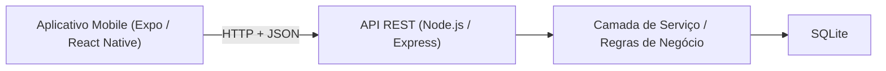
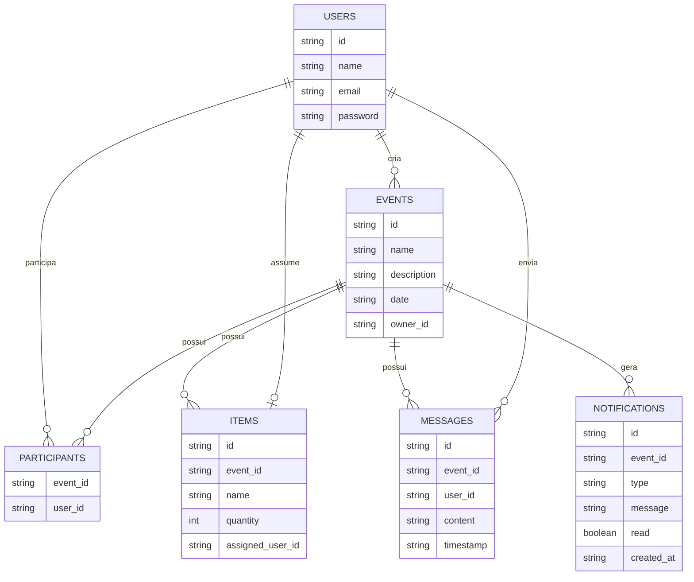
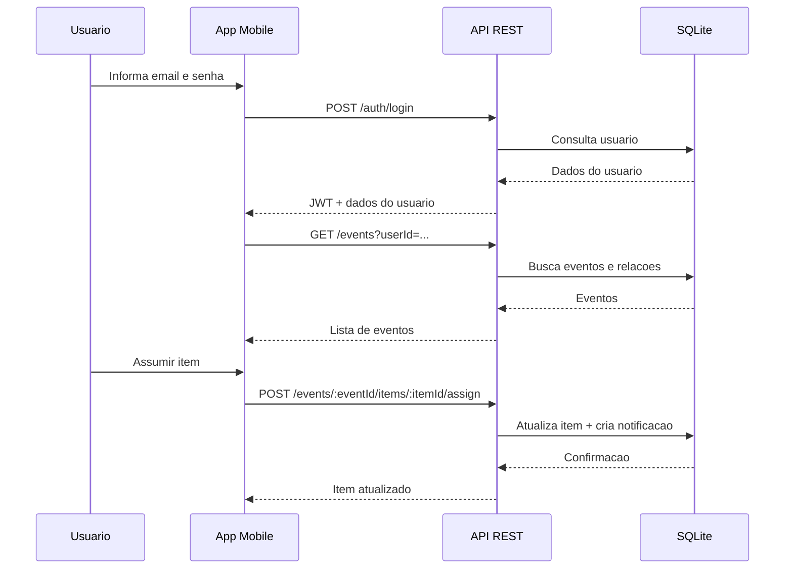

# EuLevo

## Documentação do Projeto

**Curso:** Desenvolvimento Mobile / API REST  
**Projeto:** EuLevo  
**Tipo de sistema:** Aplicação móvel com backend REST  
**Frontend:** React Native + Expo  
**Backend:** Node.js + Express + SQLite  

> Substituir pelos nomes reais dos integrantes antes da entrega.

**Integrantes do grupo**
- Integrante 1
- Integrante 2
- Integrante 3
- Integrante 4

---

## 1. Visão Geral

O **EuLevo** é um aplicativo móvel voltado para organização colaborativa de eventos. A proposta do sistema é permitir que um grupo de usuários crie eventos, compartilhe listas de itens, assuma responsabilidades por esses itens, troque mensagens no chat do evento e acompanhe notificações e histórico de alterações.

O principal objetivo do projeto é demonstrar a construção de uma solução completa com:
- aplicação móvel funcional
- consumo de API REST
- persistência em banco de dados
- autenticação
- separação de responsabilidades entre frontend e backend

---

## 2. Problema

Em eventos colaborativos, como churrascos, aniversários e confraternizações, é comum ocorrer desorganização na divisão de responsabilidades. Muitas vezes não fica claro:
- quem levará cada item
- quais itens ainda estão pendentes
- quem participa do evento
- quais alterações ocorreram ao longo do planejamento

O EuLevo foi desenvolvido para resolver esse problema por meio de uma interface móvel simples, integrada a um backend REST responsável pela persistência e validação das regras de negócio.

---

## 3. Objetivos

### 3.1 Objetivo geral

Desenvolver um sistema móvel funcional para gerenciamento colaborativo de eventos, com arquitetura cliente-servidor, API REST e banco de dados.

### 3.2 Objetivos específicos

- permitir login de usuários
- listar eventos dos quais o usuário participa
- criar e excluir eventos
- convidar participantes
- cadastrar itens por evento
- assumir e desmarcar itens
- disponibilizar chat por evento
- registrar notificações e histórico
- integrar frontend mobile e backend REST

---

## 4. Requisitos Funcionais

### RF01. Autenticação
- O sistema deve permitir login por email e senha.

### RF02. Listagem de eventos
- O sistema deve listar os eventos associados ao usuário autenticado.

### RF03. Criação de evento
- O sistema deve permitir que o usuário crie um evento com nome e descrição.

### RF04. Exclusão de evento
- O sistema deve permitir excluir um evento apenas para o seu criador.

### RF05. Participantes
- O sistema deve permitir listar participantes do evento.
- O sistema deve permitir convidar participantes apenas pelo organizador.
- O sistema não deve permitir duplicidade de participante no mesmo evento.

### RF06. Itens do evento
- O sistema deve permitir criar itens para o evento.
- O sistema deve permitir editar itens.
- O sistema deve exigir nome obrigatório e quantidade maior que zero.
- O sistema deve permitir que apenas um participante assuma um item por vez.
- O sistema deve permitir desmarcar item pelo responsável ou organizador.

### RF07. Chat
- O sistema deve permitir troca de mensagens vinculadas ao evento.
- Apenas participantes do evento podem acessar o chat.

### RF08. Notificações
- O sistema deve gerar notificações relacionadas a alterações em itens.

### RF09. Histórico
- O sistema deve exibir histórico das ações de criação, marcação, edição e desmarcação de itens.

---

## 5. Requisitos Não Funcionais

- RNF01. O sistema deve possuir arquitetura cliente-servidor.
- RNF02. O frontend deve ser executado em dispositivo móvel via Expo Go.
- RNF03. O backend deve expor uma API REST documentada.
- RNF04. O sistema deve utilizar banco de dados persistente.
- RNF05. O backend deve tratar erros com status HTTP coerentes.
- RNF06. O sistema deve possuir autenticação baseada em token JWT.
- RNF07. O backend deve permitir configuração via variáveis de ambiente.

---

## 6. Casos de Uso

### Principais atores
- Usuário autenticado
- Organizador do evento
- Participante do evento

### Casos de uso principais
- Fazer login
- Visualizar eventos
- Criar evento
- Excluir evento
- Adicionar participante
- Criar item
- Editar item
- Assumir item
- Desmarcar item
- Enviar mensagem no chat
- Visualizar notificações
- Visualizar histórico

---

## 7. Arquitetura do Sistema

O projeto foi estruturado com clara separação entre cliente e servidor.



### 7.1 Frontend

O frontend foi desenvolvido com:
- React Native
- Expo
- React Navigation

Responsabilidades do frontend:
- renderização das telas
- navegação entre fluxos
- coleta de dados do usuário
- consumo da API REST
- atualização visual baseada nas respostas do backend

### 7.2 Backend

O backend foi desenvolvido com:
- Node.js
- Express
- better-sqlite3
- JWT
- Swagger

Responsabilidades do backend:
- autenticação
- validação de regras de negócio
- acesso ao banco de dados
- persistência dos dados
- proteção de rotas
- documentação da API

---

## 8. Padrões e Organização do Projeto

O projeto adota separação por responsabilidades, aproximando-se do padrão **MVC + Service Layer**.

### 8.1 Estrutura do frontend

```text
src/
|-- core/
|   |-- api/
|   |-- navigation/
|   |-- store/
|   |-- theme/
|   `-- utils/
|-- features/
|   |-- auth/
|   |-- chat/
|   |-- events/
|   `-- participants/
`-- shared/
    |-- components/
    `-- screens/
```

### 8.2 Estrutura do backend

```text
backend/src/
|-- app.js
|-- server.js
|-- db.js
|-- seed.js
|-- config/
|-- controllers/
|-- core/
|-- docs/
|-- middlewares/
|-- routes/
`-- services/
```

### 8.3 Separação de responsabilidades no backend

- **routes**: definem endpoints e verbos HTTP
- **controllers**: recebem a requisição e delegam para a camada de serviço
- **services**: concentram regras de negócio e acesso ao banco
- **middlewares**: autenticação JWT, tratamento de erro e encapsulamento assíncrono
- **config**: leitura de variáveis de ambiente
- **docs**: especificação OpenAPI / Swagger

Essa organização atende ao critério de separação entre partes do sistema e facilita manutenção, testes e evolução.

---

## 9. Modelagem de Dados

### 9.1 Entidades principais

#### User
- id
- name
- email
- password

#### Event
- id
- name
- description
- date
- ownerId

#### Participant
- eventId
- userId

#### Item
- id
- eventId
- name
- quantity
- assignedUserId

#### Message
- id
- eventId
- userId
- content
- timestamp

#### Notification
- id
- eventId
- type
- message
- read
- createdAt

### 9.2 Diagrama de relacionamento



---

## 10. Banco de Dados

O sistema utiliza **SQLite** como banco de dados persistente, armazenado localmente no backend.

### Arquivo do banco

```text
backend/data/eulevo.db
```

### Tabelas criadas
- `users`
- `events`
- `participants`
- `items`
- `messages`
- `notifications`

### Regras de integridade
- chave primária em todas as entidades principais
- chave composta em `participants`
- chaves estrangeiras com `ON DELETE CASCADE`
- índices para melhorar buscas por evento e por usuário

---

## 11. API REST

O backend disponibiliza uma API REST baseada em JSON.

### 11.1 Endpoints implementados

| Método | Endpoint | Finalidade |
|---|---|---|
| GET | `/health` | Verificar disponibilidade da API |
| POST | `/auth/login` | Autenticar usuário |
| GET | `/users/:userId` | Buscar usuário por id |
| GET | `/events?userId=...` | Listar eventos do usuário |
| POST | `/events` | Criar evento |
| GET | `/events/:eventId` | Buscar evento |
| DELETE | `/events/:eventId` | Excluir evento |
| GET | `/events/:eventId/participants` | Listar participantes |
| POST | `/events/:eventId/participants` | Adicionar participante |
| GET | `/events/:eventId/items` | Listar itens |
| POST | `/events/:eventId/items` | Criar item |
| PATCH | `/events/:eventId/items/:itemId` | Atualizar item |
| POST | `/events/:eventId/items/:itemId/assign` | Assumir item |
| POST | `/events/:eventId/items/:itemId/unassign` | Desmarcar item |
| GET | `/events/:eventId/messages` | Listar mensagens |
| POST | `/events/:eventId/messages` | Enviar mensagem |
| GET | `/notifications?userId=...` | Listar notificações |
| POST | `/notifications/read-all` | Marcar notificações como lidas |
| GET | `/events/:eventId/history` | Exibir histórico do evento |

### 11.2 Verbos HTTP utilizados

- **GET**: leitura de dados
- **POST**: criação de recursos e ações específicas
- **PATCH**: atualização parcial de item
- **DELETE**: remoção de evento

Esse conjunto atende diretamente ao critério de implementação de API REST com operações de consulta, criação, atualização e remoção.

---

## 12. Segurança

O critério de segurança foi atendido por meio de dois mecanismos principais:

### 12.1 Criptografia

- senhas armazenadas com **hash bcrypt**
- autenticação baseada em **JWT**
- token assinado com chave secreta configurável via `.env`

### 12.2 CORS

O backend utiliza middleware `cors` para controlar a origem das requisições:

- configuração centralizada em `backend/src/app.js`
- origem configurável por variável de ambiente

### 12.3 Proteção de rotas

Todas as rotas sensíveis exigem token JWT, com exceção de:
- `GET /health`
- `POST /auth/login`

### 12.4 Observação técnica

Caso exista banco antigo populado antes da adoção do bcrypt, o login permanece compatível e a senha é migrada para hash na primeira autenticação bem-sucedida.

---

## 13. Fluxo de Funcionamento



---

## 14. Separação entre Frontend e Backend

Este critério é atendido da seguinte forma:

### Frontend
- responsável pela experiência do usuário
- navegação
- componentes visuais
- consumo de API via `fetch`
- armazenamento temporário do estado da interface

### Backend
- responsável pelas regras de negócio
- autenticação
- persistência
- validação de dados
- autorização de ações
- geração de notificações e histórico

### Integração

O frontend consome a API por meio de:
- [src/core/api/client.js](</C:\Users\ntobi\Downloads\eulevo\src\core\api\client.js>)
- [src/core/store/eulevo-store.js](</C:\Users\ntobi\Downloads\eulevo\src\core\store\eulevo-store.js>)

Essa divisão evidencia claramente que a interface móvel não acessa o banco diretamente e depende do backend para obter e alterar dados.

---

## 15. Compatibilidade entre Sistema e Documentação

### Requisitos e implementação

| Item documentado | Implementação correspondente |
|---|---|
| Login | `POST /auth/login` + tela de login |
| Lista de eventos | `GET /events` + home do app |
| Criação de evento | `POST /events` + tela de criação |
| Exclusão de evento | `DELETE /events/:eventId` + regra do criador |
| Participantes | rotas de participantes + tela dedicada |
| Itens | criação, atualização, marcação e desmarcação |
| Chat | rotas `/messages` + tela de chat |
| Histórico | `GET /events/:eventId/history` |
| Notificações | `GET /notifications` e `POST /notifications/read-all` |

### Arquitetura e código

| Elemento da arquitetura | Evidência no projeto |
|---|---|
| Cliente-servidor | app Expo consumindo API REST |
| Service Layer | `backend/src/services/eulevo-service.js` |
| Rotas | `backend/src/routes/` |
| Controllers | `backend/src/controllers/` |
| Configuração | `backend/src/config/env.js` |
| Banco de dados | `backend/src/db.js` |
| Documentação da API | `backend/src/docs/openapi.js` + `/docs` |

---

## 16. Tecnologias Utilizadas

### Frontend
- React Native
- Expo
- React Navigation
- Expo Linear Gradient

### Backend
- Node.js
- Express
- SQLite
- better-sqlite3
- bcryptjs
- jsonwebtoken
- cors
- dotenv
- swagger-ui-express

---

## 17. Evidências para a Apresentação

Durante a apresentação, a equipe deve evidenciar os critérios com as seguintes demonstrações:

### Critério 1. Compatibilidade entre sistema e documentação
- mostrar este documento
- mostrar a estrutura do projeto
- mostrar o fluxo de telas correspondente aos requisitos
- explicar a arquitetura cliente-servidor

### Critério 2. Implementação de API REST
- abrir o Swagger em `http://localhost:3333/docs`
- mostrar endpoints com `GET`, `POST`, `PATCH`, `DELETE`
- demonstrar login e listagem de eventos

### Critério 3. Segurança
- mostrar uso de JWT nas rotas protegidas
- explicar uso de hash bcrypt para senha
- mostrar configuração de CORS

### Critério 4. Separação frontend/backend
- mostrar que o app chama o backend via `fetch`
- mostrar que o banco é acessado apenas pelo backend

---

## 18. Limitações e Melhorias Futuras

- persistência de sessão no frontend
- refresh token
- upload de imagens para eventos
- push notifications reais
- websocket para chat em tempo real
- deploy em ambiente cloud
- migração de SQLite para PostgreSQL em produção

---

## 19. Conclusão

O projeto EuLevo atende aos principais objetivos propostos para a disciplina ao entregar:
- aplicação móvel funcional
- backend REST com operações completas
- persistência em banco de dados
- autenticação com JWT
- criptografia de senha com bcrypt
- documentação da API com Swagger
- separação clara entre frontend e backend

Além disso, a arquitetura adotada permite evolução do sistema, manutenção mais simples e boa apresentação dos conceitos exigidos pelo professor.

---

## 20. Referências Internas do Projeto

- Frontend principal: [src](</C:\Users\ntobi\Downloads\eulevo\src>)
- Backend principal: [backend/src](</C:\Users\ntobi\Downloads\eulevo\backend\src>)
- Documento da API: [http://localhost:3333/docs](http://localhost:3333/docs)
- Banco local: [backend/data/eulevo.db](</C:\Users\ntobi\Downloads\eulevo\backend\data\eulevo.db>)
