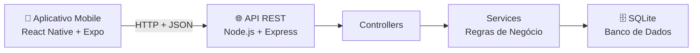

<div align="center">

# 📦 EuLevo

### Organize eventos. Divida responsabilidades. Faça tudo acontecer.

Aplicativo mobile colaborativo para organização de eventos, listas de itens, participantes, convites, chat, notificações e histórico de atividades.

[](https://reactnative.dev/)
[](https://expo.dev/)
[](https://nodejs.org/)
[](https://expressjs.com/)
[](https://sqlite.org/)
[]()
[]()

</div>

---

## 📖 Sobre o projeto

O **EuLevo** é um aplicativo mobile criado para facilitar a organização colaborativa de eventos, como confraternizações, aniversários, churrascos, reuniões, encontros acadêmicos e eventos familiares.

Por meio do aplicativo, os usuários podem criar eventos, convidar participantes, adicionar itens necessários, assumir responsabilidades, conversar em um chat exclusivo do grupo e acompanhar notificações e histórico de alterações.

O projeto utiliza uma arquitetura cliente-servidor: o aplicativo mobile consome uma API REST responsável pela autenticação, regras de negócio e persistência dos dados.

---

## ✨ Funcionalidades

| Área             | Funcionalidades                                                               |
| ---------------- | ----------------------------------------------------------------------------- |
| 🔐 Autenticação  | Cadastro, login, logout, recuperação de senha simplificada e proteção com JWT |
| 👤 Perfil        | Visualização e edição do nome do usuário                                      |
| 📅 Eventos       | Criação, visualização e exclusão de eventos pelo criador                      |
| 👥 Participantes | Busca de usuários, envio de convites, aceite e recusa de convites             |
| 📦 Itens         | Criação, edição, exclusão, assumir item e desmarcar responsabilidade          |
| 💬 Chat          | Conversas exclusivas para participantes do evento                             |
| 🔔 Notificações  | Avisos sobre alterações importantes em eventos e itens                        |
| 🕓 Histórico     | Registro de ações como criação, edição, exclusão e atualização de itens       |

---

## 🚀 Destaques da versão 1.1.0

* Nova identidade visual com paleta azul e branca.
* Tela de login redesenhada com logo do EuLevo.
* Edição de perfil corrigida, permitindo alterar o nome do usuário.
* Sistema de convites atualizado.
* Convites pendentes visíveis para o organizador.
* Participantes podem aceitar ou recusar convites.
* Busca direta de usuários cadastrados na tela de participantes.
* Chat com atualização automática.
* Atualização de itens para os participantes.
* Qualquer participante pode adicionar itens.
* Organizador pode excluir qualquer item.
* Participante pode excluir apenas os itens criados por ele.
* Eventos excluídos pelo organizador deixam de aparecer para os participantes.
* Alertas substituídos por modais visuais personalizados.
* Tela inicial reformulada com cards de eventos e botão **“Ver grupo”**.

---

## 🛠️ Tecnologias utilizadas

### Aplicativo mobile

* React Native
* Expo
* JavaScript
* React Navigation
* Expo Vector Icons
* Expo Linear Gradient

### Backend

* Node.js
* Express
* SQLite
* JWT
* bcryptjs
* Swagger

---

## 🏗️ Arquitetura do sistema



---

## 📂 Estrutura do projeto

### Frontend

```text
src/
|-- core/
|   |-- api/
|   |-- navigation/
|   |-- store/
|   |-- theme/
|   `-- utils/
|-- features/
|   |-- auth/
|   |-- chat/
|   |-- events/
|   `-- participants/
`-- shared/
    |-- components/
    `-- screens/
```

### Backend

```text
backend/
|-- data/
|-- src/
|   |-- config/
|   |-- controllers/
|   |-- core/
|   |-- docs/
|   |-- middlewares/
|   |-- routes/
|   |-- seed/
|   |-- services/
|   |-- app.js
|   `-- server.js
|-- package.json
`-- .env.example
```

---

## ⚙️ Como executar o projeto

### Pré-requisitos

Antes de iniciar, tenha instalado:

* Node.js
* npm
* Expo Go no celular
* Computador e celular conectados à mesma rede Wi-Fi

---

### 1. Executar o backend

Abra um terminal na pasta do backend:

```bash
cd backend
npm install
copy .env.example .env
npm start
```

Também é possível iniciar o backend pela raiz do projeto:

```bash
npm run backend
```

O backend será iniciado em:

```text
http://localhost:3333
```

| Recurso      | Endereço                       |
| ------------ | ------------------------------ |
| API          | `http://localhost:3333`        |
| Swagger      | `http://localhost:3333/docs`   |
| Health Check | `http://localhost:3333/health` |

---

### 2. Configurar o aplicativo mobile

Na raiz do projeto, crie o arquivo `.env`:

```bash
copy .env.example .env
```

Edite o arquivo `.env` e informe o IP da sua máquina na rede local:

```text
EXPO_PUBLIC_API_URL=http://SEU_IP_NA_REDE:3333
```

Exemplo:

```text
EXPO_PUBLIC_API_URL=http://192.168.0.10:3333
```

> ⚠️ Não utilize `localhost` no celular. O `localhost` aponta para o próprio celular, não para o computador onde o backend está rodando.

---

### 3. Executar o aplicativo

Na raiz do projeto:

```bash
npm install
npx expo start --lan --clear
```

Depois, escaneie o QR Code pelo aplicativo **Expo Go**.

---

## 🗄️ Banco de dados

O projeto utiliza o SQLite como banco de dados local e persistente.

```text
backend/data/eulevo.db
```

### Reiniciar o banco

Para apagar os dados e recriar a base inicial:

1. Apague o arquivo abaixo:

```text
backend/data/eulevo.db
```

2. Inicie o backend novamente.

---

## 🔐 Regras de negócio

* Apenas usuários autenticados podem acessar as áreas protegidas.
* Apenas o criador do evento pode excluí-lo.
* Apenas o organizador pode convidar participantes.
* O participante convidado deve possuir cadastro no aplicativo.
* Um usuário não pode receber convites duplicados para o mesmo evento.
* Um usuário já participante não pode ser convidado novamente.
* Apenas participantes podem acessar itens, participantes e chat do evento.
* Cada item pode possuir somente um responsável por vez.
* O responsável pelo item ou o organizador pode desmarcá-lo.
* O organizador pode excluir qualquer item da lista.
* Participantes podem excluir somente os itens criados por eles.
* O usuário pode editar apenas o próprio perfil.

---

## 🌐 Endpoints principais

### Autenticação

| Método | Endpoint                 | Descrição                         |
| ------ | ------------------------ | --------------------------------- |
| `POST` | `/auth/login`            | Realiza login                     |
| `POST` | `/auth/register`         | Cadastra usuário                  |
| `POST` | `/auth/recover-password` | Recuperação de senha simplificada |

### Usuários

| Método  | Endpoint         | Descrição                  |
| ------- | ---------------- | -------------------------- |
| `GET`   | `/users`         | Lista usuários cadastrados |
| `GET`   | `/users/:userId` | Busca usuário por ID       |
| `PATCH` | `/users/:userId` | Atualiza nome do usuário   |

### Eventos

| Método   | Endpoint                 | Descrição                |
| -------- | ------------------------ | ------------------------ |
| `GET`    | `/events?userId=:userId` | Lista eventos do usuário |
| `POST`   | `/events`                | Cria evento              |
| `GET`    | `/events/:eventId`       | Busca evento             |
| `DELETE` | `/events/:eventId`       | Exclui evento            |

### Participantes e convites

| Método | Endpoint                             | Descrição                 |
| ------ | ------------------------------------ | ------------------------- |
| `GET`  | `/events/:eventId/participants`      | Lista participantes       |
| `POST` | `/events/:eventId/participants`      | Envia convite             |
| `GET`  | `/events/:eventId/invitations`       | Lista convites do evento  |
| `GET`  | `/invitations?userId=:userId`        | Lista convites do usuário |
| `POST` | `/invitations/:invitationId/accept`  | Aceita convite            |
| `POST` | `/invitations/:invitationId/decline` | Recusa convite            |

### Itens

| Método   | Endpoint                                  | Descrição     |
| -------- | ----------------------------------------- | ------------- |
| `GET`    | `/events/:eventId/items`                  | Lista itens   |
| `POST`   | `/events/:eventId/items`                  | Cria item     |
| `PATCH`  | `/events/:eventId/items/:itemId`          | Atualiza item |
| `DELETE` | `/events/:eventId/items/:itemId`          | Exclui item   |
| `POST`   | `/events/:eventId/items/:itemId/assign`   | Assume item   |
| `POST`   | `/events/:eventId/items/:itemId/unassign` | Desmarca item |

### Chat, notificações e histórico

| Método | Endpoint                        | Descrição                     |
| ------ | ------------------------------- | ----------------------------- |
| `GET`  | `/events/:eventId/messages`     | Lista mensagens               |
| `POST` | `/events/:eventId/messages`     | Envia mensagem                |
| `GET`  | `/notifications?userId=:userId` | Lista notificações            |
| `POST` | `/notifications/read-all`       | Marca notificações como lidas |
| `GET`  | `/events/:eventId/history`      | Lista histórico do evento     |

> Todas as rotas, exceto login, cadastro, recuperação de senha e health check, exigem autenticação JWT.

```text
Authorization: Bearer <token>
```

---

## 🧪 Exemplos de requisições

### Health check

```bash
curl http://localhost:3333/health
```

### Login

```bash
curl -X POST http://localhost:3333/auth/login ^
  -H "Content-Type: application/json" ^
  -d "{\"email\":\"eduardo@eulevo.app\",\"password\":\"123456\"}"
```

### Listar eventos

```bash
curl "http://localhost:3333/events?userId=u1" ^
  -H "Authorization: Bearer SEU_TOKEN"
```

---

## 📚 Documentação complementar

A documentação completa do projeto inclui:

* requisitos funcionais e não funcionais;
* regras de negócio;
* casos de uso;
* diagramas UML;
* arquitetura MVC;
* modelagem de dados;
* documentação da API;
* análise de riscos;
* limitações e melhorias futuras.

📄 Consulte o arquivo:

```text
Documentacao_EuLevo_Atualizada_v1.1.0.md
```

---

## ⚠️ Limitações atuais

* O backend funciona apenas em ambiente local.
* O chat atualiza por intervalo de tempo, não por WebSocket.
* Push notifications reais ainda não foram integradas.
* Backup automático ainda não foi implementado.
* Alta disponibilidade ainda não foi implementada.
* Bloqueio temporário após cinco tentativas incorretas de login ainda não foi implementado.
* A recuperação de senha está em versão simplificada.

---

## 🔮 Próximas melhorias

* [ ] Hospedar backend e banco de dados em ambiente online.
* [ ] Implementar backup automático.
* [ ] Adicionar bloqueio após tentativas de login incorretas.
* [ ] Implementar WebSocket para chat em tempo real.
* [ ] Integrar notificações push.
* [ ] Criar APK/AAB para distribuição.
* [ ] Melhorar splash screen da versão de produção.
* [ ] Migrar o banco de dados para uma solução em nuvem.

---

## 📌 Status do projeto

```text
Versão: 1.1.0
Status: funcional em ambiente local
Frontend: React Native + Expo
Backend: Node.js + Express
Banco de dados: SQLite
```

<div align="center">

Desenvolvido como projeto acadêmico de Sistemas de Informação — UFAM / ICET.

</div>
